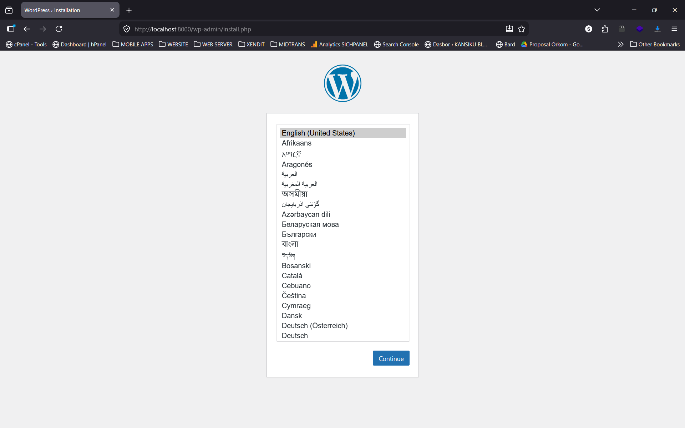
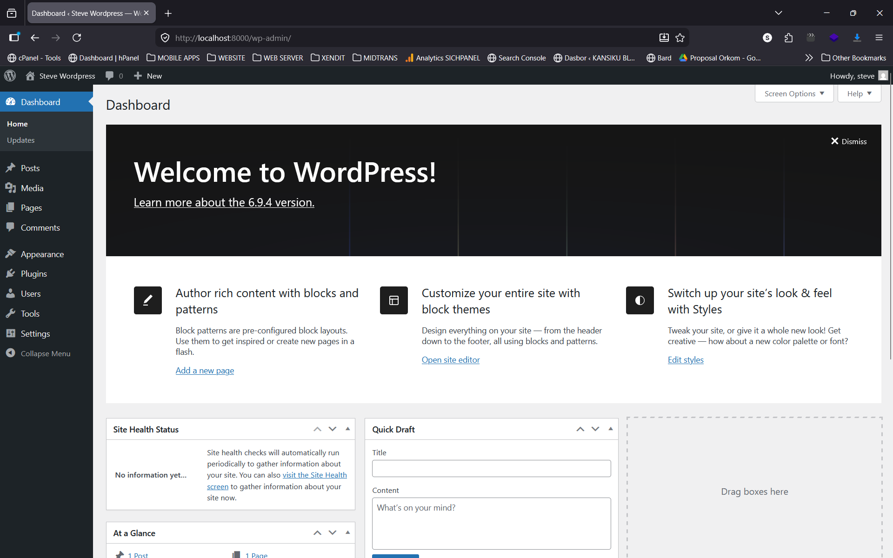
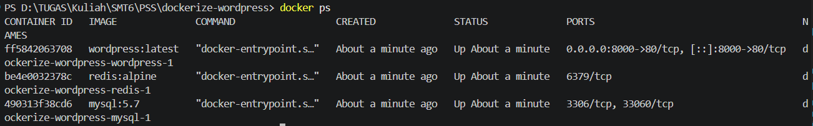

# WordPress Docker Orchestration with MySQL & Redis

Proyek ini adalah implementasi multi-container orchestration menggunakan Docker Compose untuk menjalankan WordPress dengan MySQL sebagai database dan Redis sebagai object cache.

## Langkah Menjalankan Stack

1. Clone repository ini.
2. Buka terminal di direktori proyek.
3. Jalankan perintah: `docker-compose up -d`
4. Akses instalasi WordPress di browser melalui: `http://localhost:8000`
5. Untuk mengaktifkan Redis: Login ke WP Admin, install plugin "Redis Object Cache", dan klik "Enable Object Cache".

## Dokumentasi (Screenshots)

### 1. Halaman Instalasi WordPress

Akses pertama kali di http://localhost:8000.

### 2. Dashboard WordPress

Tampilan admin panel setelah instalasi berhasil.

### 3. Docker Containers Running

Output dari perintah `docker ps`, menunjukkan 3 container (wordpress, mysql, redis) berjalan normal.

### 4. Redis CLI Ping Test

Uji koneksi ke Redis container menggunakan `redis-cli ping` yang menghasilkan balasan `PONG`.

## Q&A

_(Masukkan jawaban dari bagian 2 di sini)_
